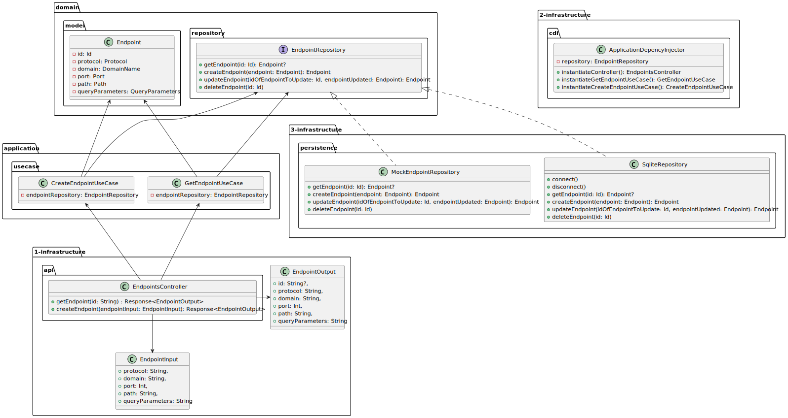

# Dragon reQuest

```shell script
./gradlew run
```

## TODO

- add the integration tests to the controller
- find a way to launch the tests in all the packages
- check the diagram
- create docker compose file
- integrate a frontend

## Architecture

The application implements the hexagonal architecture.

